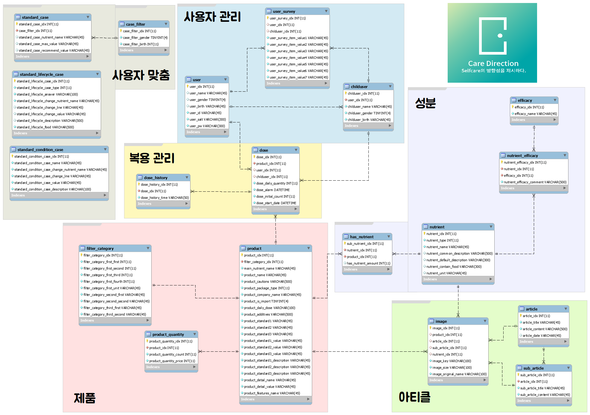

# :pill: CareDirection-Server

**Self Care의 방향성을 제시하다, Care Direction**

>개발 기간 : 19.12.21 ~ 20.01.04 

- :scroll: **[API Document](https://github.com/CareDirection/CareDirection-Server/wiki)**

  

## :computer: Develop Environment

- IDEL - **WebStorm** / ver.2019.2.1

- Language - **JavaScript**

 - Design pattern - **MVC**
   + Controller

   + DAO

   + Service

- Cloud - **AWS**
  + **AWS EC2**
  
  + **AWS RDS**
  
  + **AWS Lambda**
  
  + **AWS S3**
  
    
## :pushpin: Server Architecture

## :pushpin: ERD

## :pushpin: Dependencies

* **Release**

| Description                                                  | Name / Version              |
| ------------------------------------------------------------ | --------------------------- |
| [Validation Checker](https://hapi.dev/family/joi/)           | @hapi/joi / 16.1.8          |
| [AWS](https://docs.aws.amazon.com/sdk-for-javascript/v2/developer-guide/welcome.html) | aws-sdk / 2.270.1           |
| [JWT Token](https://www.npmjs.com/package/jsonwebtoken)      | jsonwebtoken / 8.5.1        |
| [Date Handler](https://momentjs.com/docs/)                   | moment / 2.24.0             |
| [Image Handler]()                                            | multer / 1.4.2              |
|                                                              | multer-s3-transform / 2.3.2 |
| [MySQL DataBase]()                                           | mysql / 2.17.1              |
|                                                              | promise-mysql / 3.3.1       |
| [Simplified Http Request](https://www.npmjs.com/package/request) | request / 2.88.0            |
| [Image Resizer](https://sharp.pixelplumbing.com/en/stable/)  | sharp / 0.23.4              |
| [URL compressor](https://www.npmjs.com/package/shortid)      | shortid / 2.2.15            |
|[Password Encryptor / Decryptor](https://nodejs.org/api/crypto.html)|Node.js v13.5.0 built-in|

* **Develop**

| Description                                                  | Name / Version                     |
| ------------------------------------------------------------ | ---------------------------------- |
| [ESLint Code Convetion](https://eslint.org/)                 | eslint / 4.19.1                    |
|                                                              | eslint-config-airbnb-base / 13.0.0 |
|                                                              | eslint-plugin-import / 2.13.0      |
| [JavaScript Test FrameWork](https://mochajs.org/)            | mocha / 6.2.2                      |
| [High-level abstraction for testing HTTP](https://www.npmjs.com/package/supertest) | supertest / 4.0.2                  |
| [Assertion module](https://www.npmjs.com/package/should)     | should / 13.2.3                    |

## :pushpin: Main Function

* **제품별 사용자 맞춤 데이터 (그래프)**
    * 유저별 맞춤형 건강 케어 방향성을 제공하기 위해서, 전문적인 데이터 통계를 기반으로 설문조사와 복용하는 건강 기능 식품 데이터를 분석하여 현재의 건강 지표를 가시적으로 제공합니다.
    
* **이미지 리사이징**
    * AWS Lambda 함수를 사용하여 AWS S3 버킷의 특정 루트에 이미지 생성 이벤트가 발생할시 trigger가 발생하여 자동으로 해당 이미지를 resizing합니다.

* **서명된 이미지 URL**
    * S3에 저장된 리소스 관리 시스템 구축에 필요한 aws-sdk 모듈의 getSignedUrl를 사용하여, 일정 시간이 지난 후 해당 url을 파기하고 S3 리소스에 직접적인 접근방식이 아닌 서명된 url를 통해 제공합니다.

* **미들웨어 및 모듈화**
    * 함수의 재사용성과 중복 코드 방지를 위해 미들웨어와 모듈 생성
    

## :pushpin: Team Role Sharing

**GitHub Issue**를 활용하여 역할 분담을 나누었고, 각자 라벨을 붙여 티켓의 카테고리를 정확하게 분류하였습니다. 
또한,  **GitHub Project (Kanban Chart)** 를 활용하여 개발 진행 현황을 가시적으로 나타내었습니다.

* [혁](https://github.com/CareDirection/CareDirection-Server/issues?q=is%3Aissue+is%3Aclosed+label%3A%ED%98%81)
* [재현](https://github.com/CareDirection/CareDirection-Server/issues?q=is%3Aissue+is%3Aclosed+label%3A%EC%9E%AC%ED%98%84)
* [다은](https://github.com/CareDirection/CareDirection-Server/issues?q=is%3Aissue+is%3Aclosed+label%3A%EB%8B%A4%EC%9D%80)
* [승희](https://github.com/CareDirection/CareDirection-Server/issues?q=is%3Aissue+is%3Aclosed+label%3A%EC%8A%B9%ED%9D%AC)
* [전체 역할분담](https://github.com/CareDirection/CareDirection-Server/issues?q=is%3Aissue+is%3Aclosed)
* [Kanban Chart](https://github.com/orgs/CareDirection/projects/1?card_filter_query=label%3Aserver)

## :pushpin: Work Flow

## :pushpin: Library Study

* [ESLint](https://github.com/CareDirection/CareDirection-Server/blob/develop/study/ESLint.md)
* [joi](https://github.com/CareDirection/CareDirection-Server/blob/develop/study/joi.md)
* [mocha](https://github.com/CareDirection/CareDirection-Server/blob/develop/study/mocha.md)
* [should](https://github.com/CareDirection/CareDirection-Server/blob/develop/study/should.md)
* [jwt](https://github.com/CareDirection/CareDirection-Server/blob/develop/study/jwt.md)
* [supertest](https://github.com/CareDirection/CareDirection-Server/blob/develop/study/supertest.md)

## :pushpin: Collaborator

* **윤혁** - [Malibin](https://github.com/nightmare73)
* **이재현** - [2Re-play](https://github.com/2Re-play)
* **심다은** - [Danidani](https://github.com/DaEunShim)
* **양승희** - [seunghee63](https://github.com/seunghee63)

:chart_with_downwards_trend: [Contributor List](https://github.com/CareDirection/CareDirection-Server/graphs/contributors)

